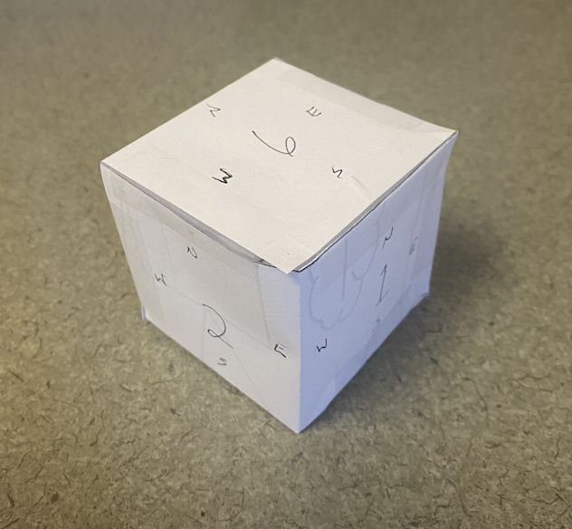

# Advent of Code 2022

My solutions to and thoughts about the problems of [AoC2022](https://adventofcode.com/2022).

WARNING: There *will* be spoilers below. Watch out!

## Code Structure

I've given each file a template that includes empty methods for Part 1 and Part 2 of each problem, along with boilerplate code to load the raw input. The input for each problem is stored as the global `INPUT`.

In a lot of problems, code can be shared between Parts 1 and 2, but there's no way to know that ahead of time. So I'll probably end up with some copypasta. I'm okay with that for two reasons: firstly, this is just for fun, and secondly, I would like Parts 1 and 2 to be able to run independently.

## Thoughts

- [Day 1](#day-1)
- [Day 2](#day-2)
- [Day 3](#day-3)
- [Day 4](#day-4)
- [Day 5](#day-5)
- [Day 6](#day-6)
- [Day 7](#day-7)
- [Day 8](#day-8)
- [Day 9](#day-9)
- [Day 10](#day-10)
- [Day 11](#day-11)
- [Day 12](#day-12)
- [Day 13](#day-13)
- [Day 14](#day-14)
- [Day 15](#day-15)
- [Day 16](#day-16)
- [Day 17](#day-17)
- [Day 18](#day-18)
- [Day 19](#day-19)
- [Day 20](#day-20)
- [Day 21](#day-21)
- [Day 22](#day-22)
- [Day 23](#day-23)
- [Day 24](#day-24)
- [Day 25](#day-25)

### Day 1

There's not really much to talk about here. For Part 1, we can just keep track of the maximum calorie count seen so far. For Part 2, we could probably keep track of the top three only, but it works just as well to tally up all the calorie counts, sort the list, and add up the top three.

---

### Day 2

For this day, there is Rock-Paper-Scissors logic going on, which we *could* implement in code. But there are only 9 possible outcomes in each part, so instead of writing out all the logic, we can precompute (by hand) the values for each of the 9 possible outcomes, store them in a dictionary, and then use the inputs to index into the dictionary. This saves a lot of time and potential mistakes.

```py
PART1_SCORES = {'A': {'X': 1 + 3, 'Y': 2 + 6, 'Z': 3 + 0},
                'B': {'X': 1 + 0, 'Y': 2 + 3, 'Z': 3 + 6},
                'C': {'X': 1 + 6, 'Y': 2 + 0, 'Z': 3 + 3}}
```

Each score is written as `move_value + outcome_value`, for readability. That ended up being a good decision, as I could easily make the edits for the new scores in Part 2.

---

### Day 3

In this problem, we're looking for overlap between lists of letters, and told that the overlap will be unique. That means that even if there's repetition in the lists, there *won't* be repetition of the overlapping item. So we can treat the lists as *sets* of letters, and use Python's `set` object to do all the heavy lifting for us. That's a powerful tool for a weak problem, but it makes the code short and sweet!

---

### Day 4

This is a classic Advent of Code-style problem! We're checking two ranges of integers for overlaps, call them $[a,b]$ and $[c,d]$.

In Part 1, we're checking for complete containment, which we can visualize as follows.

```
      Case 1                Case 2
      
      [----]               [--]
   [----------]    OR    [----------]
   |  |    |  |          | |  |     |
   a  c    d  b          c a  b     d
```

So we need to check $(a \le c \textrm{ and } d \le b)$ or $(c \le a \textrm{ and } b \le d)$. So just two cases!

In Part 2, we're checking for any overlap at all, i.e. $[a,b]\cap[c,d] \ne \emptyset$. At first, it seems like there will be more cases, because the two intervals could overlap *or* one could be entirely contained within the other. But we actually don't care *how* the intervals overlap. After some consideration, we could come up with this visualization.

```
      Case 1                Case 2
      
       [--...                [--...
   [----------]    OR    [----------]
   |   |      |          |   |      |
   a   c      b          c   a      d
```

One of the intervals will start earlier on the number line (or the same spot). So we only need to check whether or not the later interval *starts* inside the first one. Once we know that, it doesn't matter where the second interval ends because we already know that they overlap! So we again have two cases: $(a \le c \le b)$ or $(c \le a \le d)$.

---

### Day 5

This day was mostly a challenge of parsing a strangely formatted file, espcially the part detailing the initial stack of crates. The test input looks like this.

```
    [D]    
[N] [C]    
[Z] [M] [P]
 1   2   3 
```

All the crates have one-character names, so parsing this part isn't too bad. The crates names are every fourth character, starting at index 1. And the final line gives us the number of crates. So we can store all the crates as a `list` of characters from bottom to top.

After that, parsing the instructions wasn't too bad. Something like this `"move 1 from 2 to 1"` could be split on the spaces, and then we can ignore the words `move`, `from`, and `to`. Python's `namedtuple` type was nice here to do print-debugging along the way, but not really necessary.

After the instructions were parsed, we could use Python's `list` operations to do all the heavy lifting for us!

---

### Day 6

This puzzle was the quickest one yet. We can use the power of Python's `set` class again, since it "removes" duplicates. For each slice of length `n`, we can check `len(set(slice)) == n` to see if the slice contains `n` unique characters. Just like last time, this is sort of overkill for the job, but it makes the code short and sweet.

---

### Day 7

This is another AoC classic: file structures! I like the idea of parsing someone's command line log a lot. We could use lists of lists here, and just be careful about what index corresponds to what, but that's not very readable or elegant. So we can use Python's object-oriented capabilities to create two new types: `File` and `Directory`. These classes aren't very complicated, but they do exactly what we need.

```py
class Directory:
    def __init__(self, name: str = None, parent = None):
        self.name = name
        self.parent = parent
        self.children = []

class File:
    def __init__(self, name: str = None, size: int = 0):
        self.name = name
        self.size = size
```

Once we have this, parsing the output of `ls` is a simple matter of instantiating the right classea at the right time. Since the file structure is used in both parts,  we do all of this at the parsing stage.

Both parts of this problem are about the size of directories, so we need a way to calculate that. We can add a method to the directory class:

```py
class Directory:
    def calculate_size(self):
        size = 0
        for child in self.children:
            if type(child) == File:
                size += child.size
            else:
                size += child.calculate_size()
        return size
```

Note that this method has no memoization, so calling it repeatedly is *not* efficient. But the input to this problem is small enough that it won't matter. Once we have this, parts 1 and 2 are very straightforward!

---

### Day 8

> Without meaning to, I switched back to first-person singular here, rather than the mathematician-style "we" I'd been using before. I think I'll just stick with it, it makes the README more personal. :)

This day was interesting! And I really like the theme. For Part 1, I wrote four `for` loops that checked the visibility in each direction. After some finagling, they were all correct, and the problem worked! But the code was rather ugly. In four different spots, I had something like the following.

```py
    tree_height = INPUT[y][x]
    if tree_height > highest_seen:
        visible[y][x] = True
        highest_seen = tree_height
```

Code duplication within the same part of the problem is something I'm trying to avoid, so I decided to factor out this code into its own function, included below. This makes the solution much more readable. The only downside here is that this function has side-effects! In general, I like to avoid that type of thing, but I didn't want to spend too much more time refactoring. So I made a comment and moved onto part two! (Note that `INPUT` is a global, so we don't need to pass that in.)

```py
# Note: modifies the visible list
def update_visible(x: int, y: int, highest_seen: int, visible: list):
    tree_height = INPUT[y][x]
    if tree_height > highest_seen:
        visible[y][x] = True
        highest_seen = tree_height
    return highest_seen
```

In part two, I saw the potential for the same code duplication to happen, so I started with a function that could count visible trees in any direction (including diagonally, but we didn't need that here). No side-effects on this one!

```py
def count_visible(x0: int, y0: int, dx: int, dy: int):
    width = len(INPUT[0])
    height = len(INPUT)
    starting_height = INPUT[y0][x0]

    x, y = x0+dx, y0+dy
    count = 0
    while 0 <= x < width and 0 <= y < height:
        if INPUT[y][x] < starting_height:
            count += 1
        if INPUT[y][x] >= starting_height: # We can also see the last tree!
            count += 1
            break
        x += dx
        y += dy
    
    return count
```

Then it was simply a matter of searching for the tree with the highest `scenic_score`!

---

### Day 9

> I'm backtracking a little on the "we" thing from earlier. The mathematician in me can't help but write it when talking about problem solving. So I'll just mix-and-match. I think it reads pretty well still.

This day was very reminiscent of SNAKE! I really liked the visuals of the rope.

For part one, we just have a head and a tail to keep track of. The head moves only orthogonally, and we have to keep the tail next to the head, but "next to" includes diagonally. 

First, I want to show a convenient trick that I like to use whenever there is movement like this. We could code up four `if` statements (one for each direction). But the bodies of each of those statements will probably be almost identical. So we can instead use a dictionary to do the heavy lifting:

```py
directions = {'R': (1, 0), 'L': (-1, 0), 'U': (0, 1), 'D': (0, -1)}
```

Then, when we want to know how much to move, we can write something like this!

```py
move_x, move_y = directions[dir]
```

Okay, so onto the logic for the tail. Let's let `dx` and `dy` represent how far the head and tail are from each other horizontally and vertically, respectively. At each step, we have five situations:

- The head is next to the tail, i.e. `dx` and `dy` are both `<=1`. In this case the tail doesn't move.
- The head is not next to the tail and moved horizontally, i.e. `dx == 2`.
  - If `dy == 0`, the tail needs to move horizontally only.
  - Otherwise, the tail needs to move horizontally and vertically.
- The head is not next to the tail and moved vertically, i.e. `dy == 2`.
  - If `dx == 0`, the tail needs to move vertically only.
  - Otherwise, the tail needs to move horizontally and vertically.

If we allow `dx` and `dy` to be negative, we can capture the direction of horizontal/vertical movement as well. Putting this all together, we get code that looks like this.

```py
dx, dy = head_x - tail_x, head_y - tail_y

if abs(dx) == 2:
    tail_x += dx//2
    if abs(dy) == 1:
        tail_y += dy

if abs(dy) == 2:
    tail_y += dy//2
    if abs(dx) == 1:
        tail_x += dx
```

And that works perfectly! The tail moves exactly where it's supposed to. When I initally did part one, I had this code chunk in my `part1()` function. But then part two has *nine* segments that all need to move that way, so I factored it out into its own function, `get_new_location(head, tail)`, and used that in both parts.

The final step is to keep track of the unique tail locations, which we can do using a `set`. Then we just return the number of elements in the `set` and [job's done](https://www.youtube.com/watch?v=5r06heQ5HsI)!

There's one other thing I want to mention here. When I worked through part one using the test case, I wrote a function that printed out the current state of the head and tail, matching the style on the website. I can't overstate how useful this was, as I could visually inspect and identify the steps where my code was going wrong. They even recommend doing that during part two of the problem. I would highly recommend it!

---

### Day 10

Yet another classic! Drawing characters with pixels on a screen *and* interpreting assembly-style code. I love these kind of puzzles, and I have no idea how they manage to make them work with randomized inputs. It's incredibly satisfying when you see the letters pop up in the terminal at the end.

The actual coding here wasn't too challenging. It's rife with the potential for off-by-one errors, which I did run into, but other than that, it's just a matter of keeping track of the `X` register *during* every clock cycle. The number of cycles was short enough that we could just store them all in a list and refer back to it later. Since this chunk was common to both parts, I factored it out into a separate function. I don't really have much else to say about this one!

---

### Day 11

These monkeys are annoying! The main challenge of part one was parsing the input file, but it wasn't too bad. I decided to make a `Monkey` class to contain all the information for each monkey so that the code was a little more readable. This ended up being a good decision, since I could also add a couple methods to perform the operations necessary, which cleaned up the code in solutions. After that, I just implemented the logic for part one and looped 20 times. No big deal.

Part two threw me for a loop at the beginning. Ten thousand rounds instead of twenty and no longer dividing by three at each step makes the "worry values" explode! I did a check after 100 rounds and one of the values had easily over 100 digits. Python can handle arbitrarily large integers by default, but the operations do get slower and slower as the number of digits increases. So, as the puzzle says, we'll need to find another way to keep our worry levels manageable. 

Here is where my math education helped me out a ton. The monkeys all do a divisibility test with distinct primes! So if we simply multiply all the moduli, and mod out by that number every step, all of our operations will work properly (since thankfully none of the monkeys do division, although that would be mostly okay too)! One thing tripped me up here though: the test file and the actual file have a different set of primes. I was so confused why the test case wasn't working after modding out by the product of primes, but once I noticed that, everything came out correct! For me (and I'm guessing others as well), the actual file uses the first eight primes, which have a product of 2\*3\*5\*7\*11\*13\*17\*19 = 9699690. This fits in 24 bits, so even squaring a number won't go over 64 bits, which means our operations don't rely on big ints, and we can fly through the calculations. Neat!

---

### Day 12

Yet again, an advent classic! This time we're searching for a shortest path. Luckily, moving from place to place doesn't have a cost, so we can use a simple [BFS](https://en.wikipedia.org/wiki/Breadth-first_search) to find it. We need the BFS in both parts, so I ended up factoring it out once I had it written. We also probably could've used a library for this, something like [NetworkX](https://networkx.org/), but I've never used it before, so I didn't feel like learning it just for this problem. There's honestly not much else to say about today, it was short and sweet!

---

### Day 13

I really liked the way this problem was set up! Part 1 almost forces you to write a comparison function, and then Part 2 has you use it. That's good lesson planning.

We can cheat a little bit in the parsing section of this problem. Python, like many scripting languages, has an `eval` function that lets you evaluate a string of code and returns the result. Since the file is formatted as valid Python code, `eval` does all the heavy lifting for us! Executing arbitrary code downloaded from the internet is dangerous though (although `eval` isn't as dangerous as `exec`), so I took a cursory glance through the file before doing this. Advent of Code is sort of a trusted source, so I didn't worry too much, but better safe than sorry!

The comparison algorithm is recursive, so I made my `compare` function recursive as well. I think it reads pretty well! (Quick note here: I recently learned `if`-statements in Python could be one line. That's a boon for readability! I guess I just never tried it before.) I also decided to make an `enum` for the comparison results.

```py
class Order(IntEnum):
    CORRECT = -1
    INDETERMINATE = 0
    INCORRECT = 1
```

I could've just returned an integer, but I think the `enum` helps with readability. This did cause me a problem later on, as in Python, the default `Enum` class isn't comparable to integers. But they also provide `IntEnum`, which solved that issue. The choices of values doesn't matter for part one, but in part two, these choices sort the list correctly.

---

### Day 14

Today was great fun! A sort of physics simulation. While solving the problem, I wrote some code to visualize the sand falling, which helped me out a lot, and also entertained me. I actually ran into limitation of the terminal, interestingly enough. It doesn't have a high enough framerate.

The code for today was honestly not that interesting. The logic for the sand isn't complicated, and we don't need to know about the empty cells, so we can use a Python `set` for points that are a wall, and another `set` for points that are sand that has stopped moving. With these sets, checking if a space is open is very quick, and the code is efficient enough for our purposes.

Since the code wasn't really that interesting, I ([and apparently everyone else](https://www.reddit.com/r/adventofcode/comments/zlrjxg/2022_day_14_be_like/)) decided to make a visualization! I decided to only visualize part one, because part two ends up being tedious and boring towards the end. Here's the test case for part one.


And here's my full input:


They're both quite satisfying to watch in my opinion. And the visualizations were fun to make! I think maybe they wanted to see what kind of visuals people would come up with on this problem. Overall very cool.

---

### Day 15

> Warning: I do some operation counting later in this write-up, but it's only an approximation. The operations may take different amounts of time. The idea is to give an estimate for the speedup, and provide some sort of measure of efficiency.

Holy cow!!! Today was insane, puzzle-wise. Part one wasn't too bad, but I think I spent over 3 hours trying to get part two to finish in a reasonable amount of time. As someone on reddit pointed out, processor time is cheaper than programmer time, so I probably should've just set it running (with some sort of progress indicator), and gone about my day. But this puzzle really hooked me in! And my hard work paid off. I got the runtime down to around a second for both parts!

Okay, so for part one, we're only checking one row. We can use some math to figure out exactly which $x$-values are ruled out by each sensor, keep track of just those $x$-values, and count them up at the end. The only issue is that we have to be sure to also subtract the actual beacons that are in that row. At first I used Python's `set` to do this, which worked fine, but a set of over 4 million elements is getting a little out of hand. So I decided to switch to using `portion`, which keeps track of intervals of real numbers, and can handle intersections, unions, etc. However, I don't think this made much of a difference? It seems like `portion` is quite slow actually. Regardless, part one computes fast enough, so I left the `portion` solution in there.

Part two is *much* more interesting. Part one is a red herring! I initially tried to use a modified version of my solution to part one to check every single one of the 4 million rows. Which, while it would've worked just fine, took too long to finish. But each row can be checked independently, so we can parallelize! My computer has 6 physical cores with 12 virtual cores, so I tried something like this. (The `check_row` function works essentially like my solution to part one.)

```py
def part2():
    with Pool(12, init, []) as p:
        for result in p.imap_unordered(check_row, range(XY_BOUND+1), chunksize=1000):
            if result != -1:
                return result
```

While this was noticeably faster, it was still quite slow! On the order of 30 minutes or so. I did end up just letting it run until it found an answer, so that I could verify later solutions as well. For the record, this solution requires at most $4,000,000 \cdot \sum_{i=1}^{34}2d_i$ operations to complete, where $d_i$ is the distance from sensor $i$ to beacon $i$, which is absolutely massive. I've left this solution in a large comment for posterity's sake.

At this point, I had done quite a few drawings, but I hadn't reached the important insight. In fact, I didn't reach it on my own, I wound up going to the subreddit for help, because I was totally lost. Anyway, here's the insight: By the nature of the puzzle, we're guaranteed that there is *exactly one* empty space on the map at the end. Because of this, we know the distress beacon must be touching the border of 4 sensor zones. So, we can consider all sets of four sensors and check points that are common to their borders. We can narrow this down even further, as the sets of four must be close enough to even share border points. This first part requires at most ${4 \choose 2 }\cdot{34 \choose 4} = 278,256$ operations.

For each set of four sensors that are close enough, we need to find the border point that they all have in common, if there is one. At first, I implemented this naively: I just walked around the shortest border checking every point along the way. This was still faster than attempt one, but still quite slow (~5 minutes). Even the shortest borders have hundreds of thousand of points. So I went back to the drawing board (literally), and I gained one final insight: the borders are lines, and any shared points must occur where two perpendicular borders intersect! (If you don't believe me, try drawing some examples.)

Since we have four sensors, we get sixteen border lines (8 with slope 1 and 8 with slope -1). We can calculate the intersection of each of the 64 pairs of perpendicular lines, and consider only those points! We can also throw some of them away pretty early, as they're either not in bounds or don't have integer entries.  Then, at the end, for each point we find from the earlier step, we just need to check that it can't be seen by *any* sensor. Once we find one, that's the distress beacon! This was the insight that finally led to the code running in under a second. Phew.

This was the first problem this year that seriously stumped me. I wish I had figured out the first insight on my own, but I'm okay with it. I'm very happy that I got the code to run as quickly as I did though (and honestly that I finished the problem at all).

---

### Day 16

Another computationally difficult problem! Part one wasn't too bad actually. I decided to take advantage of `NetworkX` this time, and used it to find path lengths at the start. This saved me a decent amount of time, as I could focus on the main part of the algorithm. Now, we could just search all possible path orderings and see which one released the most pressure (and in fact, for part one, this works fine), but I decided that doing some pruning would be a good idea. 

We can prune in a very naive way and still get huge payoff! Throughout, we keep track of the most pressure we've released so far, including pressure released in the future. That is, if we open valve `DD` at minute two like in the example, we count that as releasing `28*20 = 560` pressure. Then we can check if we should prune in the following way: it takes 2 minutes to move one space and open one valve. We suppose we open the valves as fast as possible in the most optimal order. If that still doesn't get us to more pressure released than the best we've seen so far, then we can prune that node. This ended up giving a *NINETY-SIX* percent speedup for part one. So that's neat! After that we simply BFS with pruning and see what we get. Not too bad for part one. On the other hand...

I went through the ringer on part two, holy moly. I spent multiple hours trying to write a movement algorithm for two people that was efficient and had good pruning. The movement logic is complicated if you try to write it for both people simultaneously. I got it to run quickly eventually, but then got the same wrong answer three times in a row! This was very frustrating. On top of that, the code I was writing was incredibly ugly. Like I'm talking absolute bonkers to read. I was altogether very frustrated and also missing the correct answer.

And then, I had a breakthrough that I should've had way earlier: since the person and the elephant will never open the same valve (they're trying to be efficient!), they actually both seek out two disjoint sets of valves. So instead of solving the problem for two people simultaneously, we really just need to solve the problem for each person on disjoint subsets of the set of useful valves! And calculating two disjoint subsets isn't too bad. If our set has $n$ elements, we can consider the binary representation of all integers in $[0, 2^n - 1]$. The 1s and 0s tell us which elements go in which set, and we also know that there are exactly $2^n$ pairs of disjoint subsets (which in hindsight makes perfect sense, as that's also the size of the power set). 

Since I was able to get part one to run pretty efficiently, part two finishes in a reasonable amount of time: about four minutes on my computer. Just enough time to teach the elephant to open valves. ~~(I'm realizing as I write this and browse the subreddit that I could cache the results for each subset and then total up the time afterward. And also we could use `multiprocessing`. Ah well, the code reads nicely as it is.)~~ Whew. The last two days have been absolute doozies. Hopefully tomorrow I can reach the insight earlier.

I relented and went back and added the caching! It got just over a 2x speedup, and now part two runs in under two minutes. I think I'm finally satisfied. Calling it here.

---

### Day 17

This problem was pretty neat! Kind of tetris-esque. For part one, I had a good time matching their visualization of what was happening, which helped me debug the issues in my simulation very quickly. As always with these problems, visualizing things (programatically or otherwise) seems to help a lot. The actual simulation part was pretty straightforward! Just following the logic laid out in the problem. I don't really have much to say about part one.

Part two almost threw me for a loop! A *trillion* simulations? That's way too many to actually do (I don't have enough RAM for one). My first idea was to keep track of the maximum height in each column, and use that to run the simulation. That would solve the memory issue, but I think it wouldn't get the right answer and would still take at least a few days to run. So I spent some more time thinking and realized: there must be a point at which the tower repeats! There are only finitely many combinations of rock and starting jet, so they must line up eventually. After verifying that that was the case, I came up with this visualization:

```
  +-+
  |  \     <- final stack
  +---+
  +---+
  |   |    <- repeating chunk
  |   |
  +---+
    .
    .
    .
  +---+
  |   |    <- repeating chunk
  |   |
  +---+
  +---+
  |   |    <- repeating chunk
  |   |    
  +---+
    +--+
   /   |   <- initial stack
  +----+
```

So if we can calculate the height of each of the three types of chunks, we can calculate the total height without having to do a trillion simulations. Since there are finitely many combinations of rocks and starting jets, we can keep track of which ones we've seen and wait for a repeat. Then a little bit of math gives us the answer! I coded it up, ran it, and it worked for the test case... and then failed for the actual problem. Huh?

I spent some time walking through the output of the code to see if I could spot anything wrong with it, and eventually figured out that it was incorrectly identifying where the border between repeating chunks was. We also need to know the state of the top of the chamber to figure out where the repetition is, since we could have a repeat rock and starting jet with a different chamber state and we *wouldn't* get a repetition. So I also added the top layer of the chamber as part of the repetition key and this got the correct answer. Interestingly, I don't think that's strictly correct? Because maybe the top two or three or four layers of the chamber need to be the same. I think, technically, we need to search for repetition in a more rigorous way. But it ended up getting me the right answer and I don't feel like rewriting everything, so I won't. I'm just glad I had the insight for today earlier than Days 15 and 16.

---

### Day 18

Whew, back to something a little bit easier! Days 15, 16, and 17 were all very hard for me, so this day felt like a breath of fresh air. I like picture that formed in my head of the voxel ball of lava. Very MineCraft-esque.

For part one, we can go through all the cubes and see if any of their orthogonally adjacent spaces are open. If they are, we add each face to the total. Again, Python's `set` is doing the hard work for us, as checking if an element is in a set is an $O(1)$ operation. This ended up just being a simple counting problem. I did write a small helper to generate all the orthogonally adjacent locations. I use this "trick" of making an array of deltas a lot, since it makes the code read so much better. I think it's somewhat inefficient to declare the `directions` list in the function because of memory allocation, but for a small problem like this, it doesn't matter.

```py
def adjacent_locations(cube_loc):
    directions = [(1,0,0), (-1,0,0), (0,1,0), (0,-1,0), (0,0,1), (0,0,-1)]
    for dx, dy, dz in directions:
        yield (cube_loc[0] + dx, cube_loc[1] + dy, cube_loc[2] + dz)
```

For part two, the problem gets a little bit harder. I imagined it kind of like the fill tool in a paint program, except in 3D. We can first calculate the bounding box of the lava, and then expand by 1 unit in every direction. Then within this expanded box, we need to start at a corner and "fill" from there to find all the surrounding air (we can re-use the function above to help). Along the way, if one voxel of air is touching a voxel of lava, we count that as an exposed face. This worked great! Short and sweet problem today.

---

### Day 19

~~Still working on this one! I think my algorithm is correct, it's just absurdly slow.~~

Holy cow, this one really stumped me. It took me multiple attempts to get anything close to the right answer. Turns out, my note above was right: my algorithm *was* correct! So that's a good sign. 

Again, this is a BFS-style problem (like a lot of the others), but the transition from state-to-state is slightly complicated. At first I was modeling everything with length-4 tuples all over the place, but this got really messy and nigh-unreadable. So I decided to make a `Factory` class that contained a lot of the logic. (This is not a factory in the sense of code-patterns, but in the universe of AoC.) This helped immensely with the readability of the main loop, and I think actually ended up speeding up the code a little bit, since we were allocating objects a lot less often.

Then I spent many, *many* hours trying to optimize this search. At one point, I changed it to a `PriorityQueue` and added a heuristic... which failed miserably. It made the code slower *and* output the wrong answer. There are two optimizations which reduce the search space though. Firstly, only one robot can be built each minute. So we shouldn't build robots of one type than we'd need each minute. For example, in Blueprint 1 of the example, each robot costs at most 4 ore, so we shouldn't build more than 4 ore-mining robots. This optimization is captured in the `Factory::should_build_robot` method. Secondly, if we optimistically assume that we can build one geode robot *every minute* and that still won't get us to highest amount of geodes seen so far, it's useless to keep going down that path. This optimization is capture in the `while` loop in a few lines.

I figured out the second optimization on my own, but the first one came from reddit. After I spent so many hours on this problem, I gave up and went looking for help. Reddit also gave me the final boost, a huge time-saver that I'm almost ashamed to have not figured out on my own: time jumping. Instead of re-queueing each `Factory` after every minute passes, we can calculate how much time is needed to build the next robot, and queue only those states. This saves on memory and computation time, and is the change that ended up bringing my solve time down to a reasonable amount.

For a while I was considering rewriting my solution in C++, but I'm glad it didn't come to that.

So yeah, ultimately, I needed a lot of help on this one and I'm totally okay with that! I know that I'm not always going to see the solution or obvious optimizations. This was the very last problem I solved, and I'm happy to be done!

---

### Day 20

Another easier day, finally! This problem has a little weirdness in that we need to know the order the numbers *started in* the whole time. On my first attempt, I decided to use a `list` of `tuples` of the form `(move_order, shift_amount)`. Then we can use the `move_order` to figure out which data point is next and the `shift_amount` to move it around. At first I thought that we had to keep the front of the list the same as the example, but the starting point is always wherever zero is and the list is considered "circular," so the operations are simple swaps (yay Python one-liners).

This approach works just fine, but it's a little slow, and part two seems partially designed to punish a slow part one. In my mind the potential bottlenecks were `list` operations: searching and splicing. My algorithms class popped into my head and I thought, "Y'know, a doubly-linked list would be perfect for this!" But Python doesn't even have pointers, how do we do a linked list?? So I Googled. The answer is a [`deque`](https://docs.python.org/3/library/collections.html#collections.deque)! So instead of a list, I used a `deque` of `tuples` with the same format. I think (theoretically at least) searching is still a little slow, but using a `dict` to keep track of the move order, `deque.index` works fast enough.

The other curveball from part two is that we're supposed to multiply the shift amounts by `811589153`! If we stuck with the swapping routine, this would be absurdly slow. But luckily, we can make another optimization. These so-called "shifts" are really a removal and a reinsertion. When you remove the element, the new list becomes 1 element shorter (great insight there, I know), and so we can mod the shift amount by the original length minus one to get our insertion index.

---

### Day 21

Oh no! The monkeys are back! The creativity in all these puzzle stories is so fun. Part one was straightforward today: repeatedly loop through the monkeys, reducing the expression where possible, until all monkeys are integers. Since the final answer is supposed to be an integer, I made the assumption here that any division would not have a remainder, which seems to be true for my input (and the test input). It would be an easy change to make to handle non-integers, but seems unnecessary.

Part two required a little bit more thinking. At first I was considering a sort-of [RPN](https://en.wikipedia.org/wiki/Reverse_Polish_notation) calculator thing, but I couldn't see exactly how to make that work with the unknown `humn` variable. After that, I thought I could do a Lisp-esque interpreter, but that seemed like overkill. I spent some time mulling and decided that the final equation had to be of the form $ax+b=cx+d$, since we want exactly one answer and we're only going to end up with rational functions. While this is not strictly true (e.g. $x^2 + 2x + 4 = 0$ also only has one root), it seemed like a fair assumption.

With this in mind, I created a simple class to handle the arithmetic called `LinearExpression`. It represents `ax+b` where `a` and `b` are both of type [`Fraction`](https://docs.python.org/3/library/fractions.html). At the start, I converted all the integer values to `LinearExpression` and then used operator overloading to define the four operations. To verify my assumptions, I added checks in the operations to make sure the answers always stayed as `LinearExpression`s as well (which ended up working well). I accidentally implemented division backwards at one point, which gave me a little trouble, but once I fixed that, everything worked out nicely! The code for part two is almost identical to part one as well, which is nice. (Now that I'm thinking about that, we could even potentially factor out the code to reduce all the expressions! I'll leave it for now, but that would make for some nice readability.) 

Overall I really enjoyed this problem! And as always, the convenience of Python helped me a lot.

---

### Day 22

~~Still working on this one too! I think I've basically got it, just a few kinks to work out.~~

Whew! This one got me really stuck, and I actually ended up giving up on it for a while. When I came back to finish it, it still gave me a lot of trouble! Part one was, as usual, decently straightfoward. Walk around the map according to the instructions and figure out where you end up. However...

In part two, you "realize" the map has to be folded into a cube. The map is a [cube net](https://en.wikipedia.org/wiki/Cube#Geometric_relations), and there are *eleven* different ones! Then, when you count rotations and reflections, there 56 different possible maps you could get. I don't know of a general "this is how you turn a net into a cube" algorithm, so I decided to just solve my specific case for part two. By the way, with these numbers in mind, I have to imagine that testing this puzzle was incredibly tedious.

The main question to answer here is "how do the edges glue together?" I ended up labeling the pieces of my cube net as follows.
```
  2 1
  3
5 4
6 
```
Then, after staring at this for a while and struggling to get my 3-dimensional reasoning working, I made a physical representation and actually folded it into a cube.



This helped immensely. I would highly recommend doing this if you try to solve this problem. Once I had this model, I filled in the details in my code, wrote a couple functions to calculate how to cross the edges, ran the code, and... I got the wrong answer. I spent some time print-debugging (literally watching the little arrow zoom around the map) and couldn't figure it out. This was the point where I gave up initially. Everything *seemed* to be working correctly, but I was still getting the wrong answer.

When I came back to the problem, I decided to be a little bit more rigorous about my testing and I finally figured it out. So, my algorithm for jumping edges assigned the edge of each face a starting- and ending-point in a systematic way: if the edge was horizontal on the map, start was the left point and end was the right; otherwise, start was the top point and end was the bottom. Then it did some math with these line segments to figure out where the correct location was. But, when folding these nets, it's possible to end up with edges glued in *opposite orientations*, which I wasn't taking into account. After adding this into the algorithm, everything worked just fine.

I'm not sure what the moral is here, but __wow__ this problem was difficult for me. I'm glad I ended up coming back and solving it though. It feels good to nab that win.

---

### Day 23

Today some of my previous Advent of Code experience helped me out! It appears that the elves are trying to spread out on an infinitely large plane, so the map is going to get larger and larger. But locations are either empty or have an elf in them, and there's only finitely many elves. So we can keep track of *only* the elves' locations in a `set` and use that to do all our checks. That has two benefits: fixed memory cost *and* it actually simplifies the code a little bit, since we don't have to worry about expanding the map if need-be.

This foresight made part two of the problem very straightforward. I factored out the movement code and added two lines to keep track of the number of elves that actually moved. The logic for today was pretty straightforward as well, so it was short and sweet (and fun of course!).

---

### Day 24

Gosh, so many [BFS](https://en.wikipedia.org/wiki/Breadth-first_search)-style problems this year! This one was super interesting because the movement restrictions changed every time step. The nice thing though was that they cycled, so we could precalculate all the cycles and then use those precalculated maps to search for open positions. In hindsight, I don't think the cycling was *that* important, but the precalculation was definitely a good call. It made the code faster to run and easier to write.

Other than that, the code is really a standard BFS, which I ended up factoring out for part two. There weren't any huge hurdles, but it was still a fun problem. Merry Christmas Eve!

---

### Day 25

As usual, a somewhat more straightforward problem on Christmas Day. And only one part! At the time of writing I still haven't finished Day 19 or Day 22, but I plan to do them soon.

I believe the numeral system in this problem should be called "balanced quinary." I've heard of [balanced ternary](https://en.wikipedia.org/wiki/Balanced_ternary) before, so it makes sense that this could be expanded to a larger base. This problem *is* technically one part, but there are two different pieces to that part. We need to convert from balanced quinary to Python integers *and back*. Converting to Python integers is straightforward: multiply each digit's value by its place value and sum.

Converting back is more difficult. After pondering this for a while, I decided to first convert to normal quinary representation and then convert from there to balanced quinary. This conversion is easier to explain using an example. Consider $39_{10} = 124_5$. Working through the quinary digits backwards, we first run into $4$ in the 1s place, which *is not* a balanced-quinary digit. But, if we subtract $5$, we get $-1$, which *is* a balanced quinary digit. We do need to add that 5 back somewhere else and the next digit is the 5s place, so we add can add 1 to that digit! Our new representation becomes $39_{10} = 13\bar1_5$ (where $\bar1 = -1$). Then we move up one place to the $3$, which again, isn't a balanced-quinary digit. So we do the same process and et $39_{10} = 2\bar2\bar1_5$. Finally, the 25s digit is $2$, which is a balanced-quinary digit, so we're done!

I have a feeling there's a faster way to do this conversion, but the above algorithm works and is fast enough! Merry Christmas!